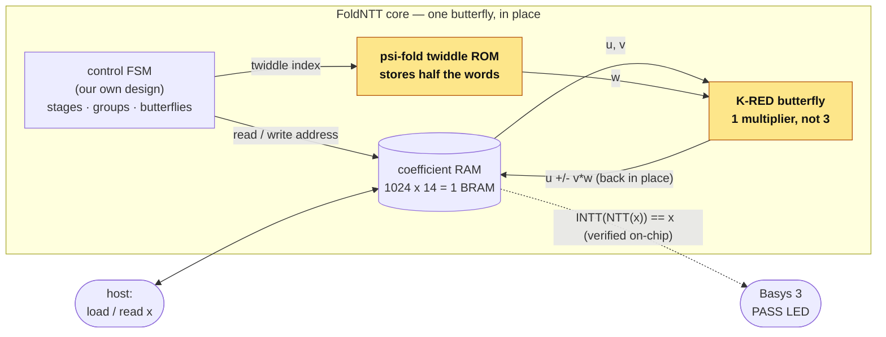

# FoldNTT

<p align="center">
  <br/>
  <sub><i>FoldNTT as a 3D floor-plan (generated by <a href="https://github.com/NyxFoundation">visually-3d</a>, grounded in the real RTL): copper K-RED multipliers (1 DSP each, not 3), the half-size ψ-fold ROM, the banked coefficient memory and the control/verification blocks. This is the view in which the ψ-fold idea was first spotted.</i></sub>
</p>

[](https://github.com/NyxFoundation/FoldNTT/actions/workflows/verify.yml)

FoldNTT is one thing: a more efficient chip design for the polynomial
multiplication at the heart of post-quantum cryptography, proven correct.

The contribution in one sentence: because the cryptographic prime
q = 12289 = 3·2¹² + 1 has a special algebraic shape, and because the table
of precomputed constants has a mirror symmetry, most of the multiplication
hardware and half of the constant storage can be replaced by a few
shift-and-add gates, so the chip computes exactly the same transform with
one hardware multiplier instead of three and half the stored constants, at
the same speed, and every step is machine-proven equal to the mathematics.

No hardware background is needed to see why this matters. Multiplier
circuits are the scarcest resource on these chips, and computing the
remainder after division by q is normally what consumes them. The prime's
shape makes that remainder computable with shifts and additions (the K-RED
trick), and the symmetry w[N/2+j] = ψ·w[j] means half the constant table
is redundant: one shift-and-subtract recreates it. Proving every step
equal to the mathematics, instead of testing a few examples, is also what
exposed a real bug in the original design's inverse transform (reported
upstream).

The name: both ideas fold something. K-RED folds the remainder step into
shift-adds, and the ψ-fold ROM folds the constant table in half.

FoldNTT began as a formal-verification study of the released CFNTT radix-2
accelerator ([xiang-rc/cfntt_ref](https://github.com/xiang-rc/cfntt_ref), Chen
et al., TCHES 2022). That study found the inverse-transform bug; the project
became an own-FSM architecture that fixes it with fewer multipliers, running
end-to-end on a real FPGA (a Basys 3 board) with no vendor software.

## Architecture

The accelerator is one butterfly working in place: a control FSM walks the
transform (stages → groups → butterflies), reading two coefficients and a
twiddle each step and writing the two results straight back. The two folds,
the K-RED butterfly and the ψ-fold ROM (highlighted in the diagrams), provide
the DSP and ROM savings.



Inside the butterfly, one K-RED multiplier replaces the reference's three
(the two extra Barrett multipliers become shift-adds). The per-stage `×½`
gate on the inverse path, fused from the same twiddle, fixes the bug we
found:


Block to folder: the butterfly is [`kred-butterfly/`](kred-butterfly/), the
twiddle ROM is [`psi-fold-rom/`](psi-fold-rom/), and the FSM + RAM + on-board
self-test are [`ntt-core/`](ntt-core/). The paper's Fig. 1 in [`docs/`](docs/)
shows the same butterfly at gate/register level.

## How it was found

The two folds came out of a recursive loop we call Visioned Vibe Coding:
formally verify the design, render it as a 3D floor-plan model
([visually-3d](https://github.com/NyxFoundation)), show the renders to a
vision-language model, turn its observations into design changes, and
verify again before accepting anything. The ψ-fold was spotted in the
render itself: after K-RED shrank the arithmetic, the twiddle ROM was
visibly the largest block left, and half of it turned out to be
mathematically redundant.

<p align="center">
  <br/>
  <sub><i>The model across the loop's 37 revisions: first draft (v1); matured CFNTT floor plan, Barrett with 3 DSP (v31); the K-RED butterfly lands (v32); the ψ-fold is spotted (v36); FoldNTT final (v37). The full revision history, with the verification verdicts between steps, is published with the gallery.</i></sub>
</p>

## Inventions

| Folder | Invention | Verified | Result |
|---|---|---|---|
| [`kred-butterfly/`](kred-butterfly/) | 1-multiplier **K-RED** butterfly (shift-add reduction; fuses the inverse-transform halving) | z3 full-domain + SymbiYosys | **3→1 DSP** / butterfly |
| [`psi-fold-rom/`](psi-fold-rom/) | **ψ-fold** twiddle ROM: stores half the words, shift-add derives the rest | z3 + SbY miter vs shipped ROM | **−50%** stored bits |
| [`ntt-core/`](ntt-core/) | the **architecture**: own-FSM banked core + Basys 3 self-test | iverilog round-trip + golden cross-check | `INTT(NTT(x))==x`; 1 DSP, 1 BRAM |
| [`generator/`](generator/) | generalization to **any Proth prime** (Falcon + Kyber) | exhaustive on Kyber q=3329 | one core, many primes |
| [`fpga/`](fpga/) | open FPGA flow: area, post-route Fmax, bitstream (openXC7) | CI | ~136 MHz core, no Vivado |
| [`verification/`](verification/) | the CFNTT reference proofs, the bug finding, mutation non-vacuity | z3 + SbY, CI | bug reported upstream |
| [`docs/`](docs/) | the paper (single-column + IEEE two-column builds) | | |
| `cfntt_ref/` | the upstream CFNTT reference (git submodule) | | ground truth |

## Quickstart

```sh
git clone --recurse-submodules https://github.com/NyxFoundation/FoldNTT.git
cd FoldNTT

# 1. verification suite (z3 + SymbiYosys + iverilog), reproducible in CI:
nix develop            # or: uv + a YosysHQ/oss-cad-suite env
./run_all.sh           # -> ALL FoldNTT INVENTION CHECKS PASS

# 2. the new core end-to-end (own FSM, banked memory):
python3 ntt-core/run_check.py     # round-trip + NTT cross-validation -> ALL PASS

# 3. FPGA — area + post-route Fmax, NO Vivado (openXC7):
nix develop; fpga/fmax.sh; fpga/fmax_core.sh

# 4. on-board demo bitstream for a Digilent Basys 3 (xc7a35t), Vivado-free:
bash ntt-core/bit.sh              # -> ntt-core/build/design.bit
openFPGALoader -b basys3 ntt-core/build/design.bit   # LED1 = self-test PASS
```

`flake.nix` pins the whole toolchain (including the exact openXC7 tag), so
`nix develop` gives a shell where all of the above run with no further setup.

## Results (measured, CI-reproducible)

- **DSP** 3→1 per butterfly; the whole shipped core uses 1 DSP and 1 BRAM at
  ~136 MHz (open flow, Artix-7 xc7a100t). The K-RED multiplier is Fmax-neutral.
- **Twiddle ROM** −50% stored bits (ψ-fold), proven equal to the shipped table.
- **Correctness** the own-FSM core round-trips `INTT(NTT(x))==x` and its NTT
  matches the golden reference bit-for-bit; the reference's inverse-transform
  bug (missing per-stage halving) was found by verification, reported upstream.
- **Open toolchain** synthesis → place-and-route → bitstream with no Vivado
  (yosys + openXC7 nextpnr-xilinx + prjxray).
- MIT-licensed throughout (the upstream `cfntt_ref` submodule is also MIT).

See [`docs/`](docs/) for the paper and [`docs/venue-assessment.md`](docs/venue-assessment.md)
for the submission strategy.
