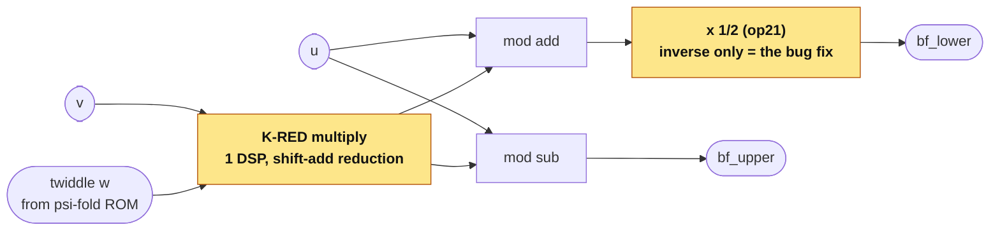

# FoldNTT

[](https://github.com/NyxFoundation/FoldNTT/actions/workflows/verify.yml)

**A new, formally-verified, DSP-minimal NTT accelerator for Falcon / Proth
primes — with an on-board Basys 3 demo, entirely Vivado-free.**

*Why "Fold"?* Both core ideas **fold**: **K-RED** folds modular reduction into
shift-adds (one multiplier per butterfly instead of three), and the **ψ-fold**
twiddle ROM folds the table in half (a shift-add derives the other half). Every
module is proven equal to its mathematical spec with z3 + SymbiYosys, and the
whole core runs end-to-end on a real FPGA.

FoldNTT began as a formal-verification study of the released **CFNTT** radix-2
accelerator ([xiang-rc/cfntt_ref](https://github.com/xiang-rc/cfntt_ref), Chen
et al., TCHES 2022) — that study *found a real bug* in its inverse transform
and grew into an own-FSM architecture that fixes it and is DSP-lean by design.

## Architecture

The whole accelerator is **one butterfly working in place**: a control FSM
walks the transform (stages → groups → butterflies), reading two coefficients
and a twiddle each step, and writing the two results straight back. The two
🟡 **folds** — the K-RED butterfly and the ψ-fold ROM — are where the savings
live.


Inside the butterfly, one **K-RED** multiplier replaces the reference's three
(the extra two Barrett multipliers become shift-adds), and the per-stage `×½`
gate on the inverse path — fused from the same twiddle — is the fix for the
bug we found:



*Block → folder:* the butterfly is [`kred-butterfly/`](kred-butterfly/), the
twiddle ROM is [`psi-fold-rom/`](psi-fold-rom/), and the FSM + RAM + on-board
self-test are [`ntt-core/`](ntt-core/). (The paper's Fig. 1 in [`docs/`](docs/)
is the same butterfly at gate/register level.)

## Inventions (one folder each)

| Folder | Invention | Verified | Result |
|---|---|---|---|
| [`kred-butterfly/`](kred-butterfly/) | 1-multiplier **K-RED** butterfly (shift-add reduction; fuses the inverse-transform halving) | z3 full-domain + SymbiYosys | **3→1 DSP** / butterfly |
| [`psi-fold-rom/`](psi-fold-rom/) | **ψ-fold** twiddle ROM — stores half the words, shift-add derives the rest | z3 + SbY miter vs shipped ROM | **−50%** stored bits |
| [`ntt-core/`](ntt-core/) | the **architecture**: own-FSM banked core + Basys 3 self-test | iverilog round-trip + golden cross-check | `INTT(NTT(x))==x`; 1 DSP, 1 BRAM |
| [`generator/`](generator/) | generalization to **any Proth prime** (Falcon + Kyber) | exhaustive on Kyber q=3329 | one core, many primes |
| [`fpga/`](fpga/) | open FPGA flow — area, post-route **Fmax**, bitstream (openXC7) | CI | ~136 MHz core, no Vivado |
| [`verification/`](verification/) | the CFNTT reference proofs, the bug finding, mutation non-vacuity | z3 + SbY, CI | bug reported upstream |
| [`docs/`](docs/) | the paper (single-column + IEEE two-column builds) | | |
| `cfntt_ref/` | the upstream CFNTT reference (git submodule) | | ground truth |

## Quickstart

```sh
git clone --recurse-submodules https://github.com/NyxFoundation/FoldNTT.git
cd FoldNTT

# 1. verification suite (z3 + SymbiYosys + iverilog), reproducible in CI:
nix develop            # or: uv + a YosysHQ/oss-cad-suite env
./run_all.sh           # -> ALL FoldNTT INVENTION CHECKS PASS

# 2. the new core end-to-end (own FSM, banked memory):
python3 ntt-core/run_check.py     # round-trip + NTT cross-validation -> ALL PASS

# 3. FPGA — area + post-route Fmax, NO Vivado (openXC7):
nix develop; fpga/fmax.sh; fpga/fmax_core.sh

# 4. on-board demo bitstream for a Digilent Basys 3 (xc7a35t), Vivado-free:
bash ntt-core/bit.sh              # -> ntt-core/build/design.bit
openFPGALoader -b basys3 ntt-core/build/design.bit   # LED1 = self-test PASS
```

`flake.nix` pins the whole toolchain (including the exact openXC7 tag), so
`nix develop` gives a shell where all of the above run with no further setup.

## Results (measured, CI-reproducible)

- **DSP** 3→1 per butterfly; whole shipped core **1 DSP, 1 BRAM**, ~136 MHz
  (open-flow, Artix-7 xc7a100t) — the K-RED multiplier is Fmax-neutral.
- **Twiddle ROM** −50% stored bits (ψ-fold), proven equal to the shipped table.
- **Correctness** the own-FSM core round-trips `INTT(NTT(x))==x` and its NTT
  matches the golden reference bit-for-bit; the reference's inverse-transform
  bug (missing per-stage halving) was found *by verifying* and reported upstream.
- **Open toolchain** synthesis → place-and-route → **bitstream** with no Vivado
  (yosys + openXC7 nextpnr-xilinx + prjxray).

See [`docs/`](docs/) for the paper and [`docs/venue-assessment.md`](docs/venue-assessment.md)
for an honest submission strategy.
